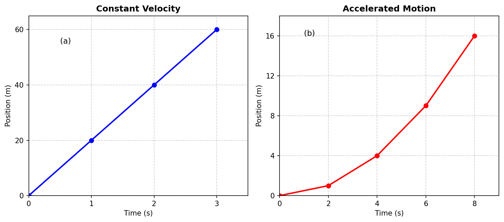
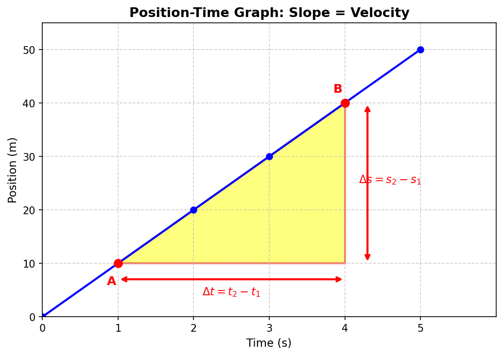
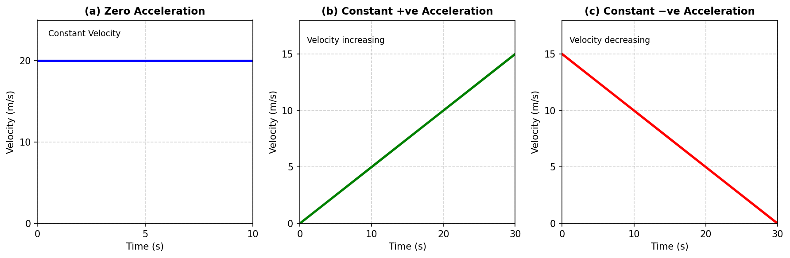
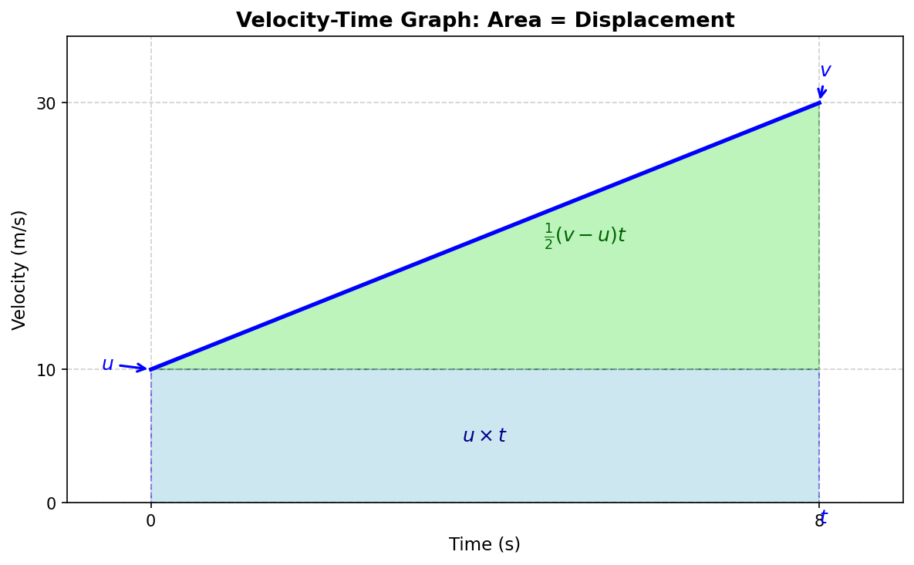
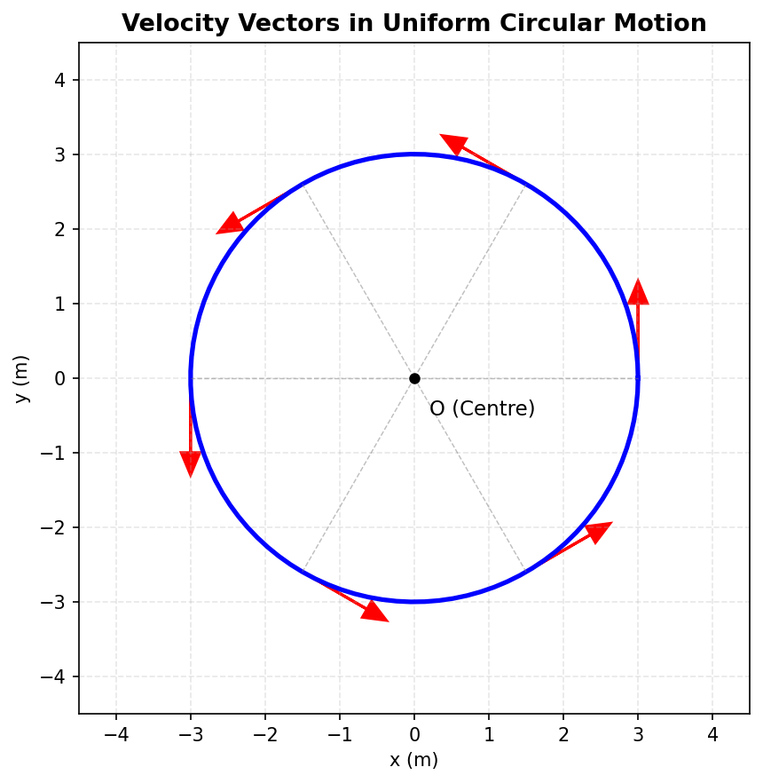

# Chapter 4: Describing Motion Around Us — Revision Notes

---

## 1. Position and Motion

- **Reference point (origin):** A fixed point used to describe an object's position.
- **Position of an object** = distance + direction from the reference point.
- **In motion:** position changes with time w.r.t. reference point.
- **At rest:** position does not change with time w.r.t. reference point.
- **Linear motion (straight-line motion):** simplest type of motion; object moves along a straight line. Example: a swimmer, a falling ball, a car on a straight road.
- **Sign convention:** Right of origin = positive (+), Left of origin = negative (−).

> 🧠 **Competency-Based Question:**
> Two students stand at different ends of a classroom and both claim a hanging fan is "moving" because the blades cross their line of sight. Explain why a reference point is essential before saying anything is "in motion," using the fan example.

---

## 2. Distance and Displacement

| Quantity | Meaning | Direction needed? | SI Unit |
|---|---|---|---|
| **Distance travelled** | Total path length covered | No | metre (m) |
| **Displacement** | Net change in position (shortest path, with direction) between two instants | Yes | metre (m) |

- **Magnitude** = numerical value (with unit) of a quantity needing direction.
- **Scalars:** need only magnitude (e.g., distance). **Vectors:** need magnitude + direction (e.g., displacement) — *higher grade concept*.
- **Key rule:** Magnitude of displacement ≤ Total distance travelled (always).
  - They are **equal** only when the object moves in **one direction without turning back**.

**Worked Example (Athlete on a track):**
O → B (40 m) → A (100 m) → back to B (40 m)
Total distance = OA + AB = 100 + 60 = 160 m
Displacement = OB = 40 m (since start = O, end = B)

> 🧠 **Competency-Based Question:**
> A delivery drone flies 300 m east, then 300 m west back to its starting warehouse. (a) Find its total distance and displacement. (b) Why would a delivery company care more about "distance" than "displacement" when calculating battery usage?

---

## 3. Average Speed and Average Velocity

### Average Speed
$$\text{average speed} = \dfrac{\text{total distance travelled}}{\text{time interval}}$$
- Has **only magnitude**, no direction (since distance has no direction).

### Average Velocity
$$\text{average velocity} = \dfrac{\text{displacement}}{\text{time interval}} = \dfrac{s}{t}$$
- Has **magnitude + direction** (direction same as displacement; shown by + or − sign).
- SI unit (both speed & velocity): **m/s** (also km/h commonly used).
- Average velocity = **average rate of change of position** with respect to time.

### Uniform vs Non-Uniform Motion
- **Uniform motion:** equal distances in equal time intervals → constant speed.
- **Non-uniform motion:** unequal distances in equal time intervals → speed increasing/decreasing.

> ⚠️ **Important Rule:** For straight-line motion in **one direction only**, average speed = magnitude of average velocity. If the object reverses direction, they are generally different.

**Worked Example (Swimming pool, 25 m pool, one lap forward + back = 50 m):**
Time = 50 s → Total distance = 50 m, Displacement = 0 m
Average speed = 50/50 = **1 m/s**
Average velocity = 0/50 = **0 m/s**

> 🧠 **Competency-Based Question:**
> A car's speedometer reads "60 km/h" the entire time it drives around a circular roundabout and exits going in the opposite direction it entered. Is its average speed equal to 60 km/h for the trip? Is its average velocity also 60 km/h? Justify using the concepts above.

---

## 4. Average Acceleration

$$\text{average acceleration} = \dfrac{\text{change in velocity}}{\text{time interval}} = \dfrac{v-u}{t_2-t_1}$$

where **u** = initial velocity, **v** = final velocity.

- SI unit: **m/s²**
- Needs **magnitude + direction**.
- **Direction rule (straight line motion):**
  - Speed **increasing** → acceleration is in **same direction** as velocity.
  - Speed **decreasing** → acceleration is **opposite** to velocity direction.
- A **constant acceleration** means velocity changes by equal amounts in equal time intervals.
- An object can move very fast yet have **zero acceleration** (constant velocity motion).
- Acceleration due to gravity (free fall) is constant ≈ **9.8 m/s²**, denoted **g**, directed downward (in direction of motion while falling).

**Worked Example (Bus speeding up then braking):**
- Accelerator pressed: u = 10 m/s, v = 15 m/s, t = 10 s → a = (15−10)/10 = **+0.5 m/s²** (same direction as velocity)
- Brakes pressed: u = 15 m/s, v = 0, t = 5 s → a = (0−15)/5 = **−3 m/s²** (opposite to velocity direction)

> 🧠 **Competency-Based Question:**
> A passenger says, "I didn't feel any jolt, so the car's acceleration must be zero — even though the speedometer shows the car is moving very fast." Is the passenger's reasoning correct? Explain with reference to what acceleration actually depends on.

---

## 5. Graphical Representation of Motion

*Fig. 4.13(a) & (b): Position-time graphs — straight line for constant velocity, curved (parabolic) line for accelerated motion.*

### 5.1 Position–Time Graphs

| Shape of graph | Meaning |
|---|---|
| Straight line (sloped) | Constant velocity |
| Straight line parallel to time-axis | Object at rest (stationary) |
| Curved line | Velocity changing → accelerated motion |
| Steeper line/curve | Higher velocity |

- **Slope of position–time graph = velocity** (slope = change in position ÷ change in time).
- Comparing two objects' position-time graphs: the one with the **steeper slope** has higher velocity.

*Fig. 4.14: Slope of position-time graph = velocity. The right triangle shows Δs/Δt.*

### 5.2 Velocity–Time Graphs

*Fig. 4.17(a),(b),(c): Velocity-time graphs — zero, positive, and negative acceleration.*

| Shape of graph | Meaning |
|---|---|
| Straight line parallel to time-axis | Constant velocity, acceleration = 0 |
| Straight line, sloping upward | Velocity increasing, constant +ve acceleration |
| Straight line, sloping downward | Velocity decreasing, constant −ve acceleration (opposite to velocity) |

**Two key things calculated from a velocity-time graph:**

1. **Slope of the line = acceleration**
$$a = \dfrac{v-u}{t_2-t_1}$$

2. **Area enclosed between the line and the time-axis = displacement**
   - If velocity is constant: Area of rectangle = velocity × time = displacement.
   - If velocity changes uniformly: Area = area of rectangle + area of triangle (trapezium shape).

*Fig. 4.19: Area under velocity-time graph gives displacement. Shaded area = ut + ½(v−u)t = ut + ½at².*

> 🧠 **Competency-Based Question:**
> Look at a velocity-time graph of a cyclist that rises, stays flat, then falls back to zero. Without doing any calculation, explain in words during which part of the journey the cyclist (a) is accelerating forward, (b) is moving at constant speed, (c) is decelerating, and (d) how you would find the total distance covered using the graph.

---

## 6. Kinematic Equations (Motion in a Straight Line, Constant Acceleration)

Where: **u** = initial velocity, **v** = final velocity, **a** = acceleration, **t** = time, **s** = displacement

$$v = u + at \tag{4.4a}$$
$$s = ut + \dfrac{1}{2}at^2 \tag{4.4b}$$
$$v^2 = u^2 + 2as \tag{4.4c}$$

> ⚠️ **Valid only when acceleration is constant.** Sign of u, v, a, s shows direction.

**Worked Example:**
Car brakes: a = −4 m/s², final v = 0
Using v² = u² + 2as → s = u²/8
- If u = 15 m/s (54 km/h) → s = 28.1 m
- If u = 30 m/s (108 km/h) → s = 112.5 m
(Shows: doubling speed → braking distance becomes **4×**, not 2× — important real-world safety insight!)

> 🧠 **Competency-Based Question:**
> A traffic safety officer claims, "If you double your driving speed, you only need double the braking distance to stop safely." Use the kinematic equations to check if this claim is correct. What is the actual relationship between speed and stopping distance?

---

## 7. Motion in a Plane (Two Dimensions)

- Motion not confined to a straight line — e.g., a kicked ball's path, a vehicle overtaking, a satellite's circular path.

### Uniform Circular Motion

- **Circular motion:** object moves along a circular path.
- **Uniform circular motion (UCM):** object moves on a circular path with **constant speed**.
- For one complete revolution (radius R, time T):
$$\text{average speed} = \dfrac{2\pi R}{T}$$
- **Displacement after one full revolution = 0** (returns to starting point), but distance travelled = 2πR.
- **Speed is constant, but velocity is NOT constant** — because **direction** of velocity keeps changing continuously (velocity is always along the **tangent** to the circle at that point).
- Since velocity direction changes continuously → **UCM is accelerated motion**, even though speed doesn't change.
- A circular path can be thought of as the limit of a polygon (square → hexagon → ...) with infinite sides, where direction changes continuously instead of at sharp corners.

*Fig. 4.23(c): Velocity vectors tangential to the circular path. Direction changes continuously, so UCM is accelerated motion even at constant speed.*

> 🧠 **Competency-Based Question:**
> A friend argues: "The Moon orbits Earth at constant speed, so it has zero acceleration." Do you agree or disagree? Use the idea of uniform circular motion to correct or support this statement.

---

## 📜 India's Scientific Contributions *(Important History Box for Exams)*

> The concept that **speed = distance ÷ time** is ancient and well-established in Indian mathematics, dating back to the ***Aryabhatiya*** (5th century CE). A classic problem on this concept comes from the ***Ganitakaumudi*** (14th century CE):
>
> **Problem:** Two postmen start walking towards each other from 210 *yojanas* apart. One walks 9 *yojanas*/day, the other 5 *yojanas*/day. In how many days do they meet?
>
> **Solution:**
> Combined distance covered per day = 9 + 5 = 14 *yojanas*
> Time to cover 210 *yojanas* together = 210 ÷ 14 = **15 days**
> (In 15 days: 1st postman covers 135 *yojanas*, 2nd covers 75 *yojanas*)

---

## Quick Revision Box (Formula Sheet)

| Concept | Formula |
|---|---|
| Average speed | total distance ÷ time interval |
| Average velocity | displacement ÷ time interval = s/t |
| Average acceleration | (v − u) ÷ t |
| Kinematic Eq. 1 | v = u + at |
| Kinematic Eq. 2 | s = ut + ½at² |
| Kinematic Eq. 3 | v² = u² + 2as |
| Speed in UCM (1 revolution) | 2πR / T |

### Important Notes to Remember
- Distance & displacement, speed & velocity are **equal only** for straight-line motion in **one direction**.
- Slope of position-time graph → **velocity**
- Slope of velocity-time graph → **acceleration**
- Area under velocity-time graph → **displacement**
- A graph is **not a route map** — it shows how a quantity changes with time, not the physical path.
- Acceleration depends on **how fast velocity changes**, not on how fast the object is moving.